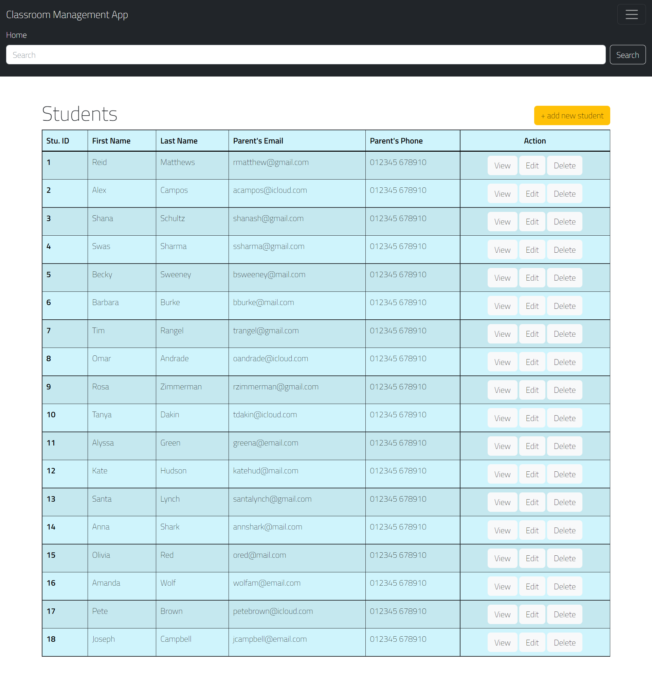

# 👩‍💻Team Violet Pangolins👨‍💻

---

## 🏫 Classroom Management App

This application is designed to help Pre-School teachers access to a platform where they can add students, remove students, and have students' parents emails and phone numbers in case of emergencies, as well as write notes or comments in the student profile. In this project we will build and design this Classroom Management app using the MVC paradigm, create our own server-side API, add user authentication, and connect to a database.

## ✍️User Story:

```
As a PreSchool Teacher I want to be able to open and navigate a webpage
The webpage provides a landing page with a list student names in my class
```

## 📑Acceptance Creteria:

```
Given a webpage functions properly
When I am in the classroom portal
Then I am presented with a list of students in my classroom
When I click on an "Action" (View)
Then I am able to view student name/parent's contact info/any notes about the student
When I click on an "Action" (Edit)
Then I am able to edit student name/parent's contact info/any notes about the student and save my entries
When I click on an "Action" (Delete)
Then I am able to remove the student's record from my list
When I click on the "+ Add Student" button in the home page
Then I am able to enter values for name, parent's contact info, and notes of the student and add them to my classroom list
When I want to "search" for a student using either a letter or specific name
Then I can click on the hamburger menu, and make an entry in the "Search" field
Then I am able to generate a list of students with that name, or with that letter in their name
```

## 📹Website Demo:



### 💻Heroku Link to the Website:

- https://warm-beyond-95422.herokuapp.com/

### 📂Link to the Github Repo (Deployed version in Heroku):

- https://github.com/meriem0319/User-Management

### 📂Link to the (original) Github Repo with all contributor's commits:

- https://github.com/jmp2814/violet-pangolins

### ✒️Authors:

- Jake Perry
- Meriem Powell
- Olesia Chugaieva
- Nick Maier
